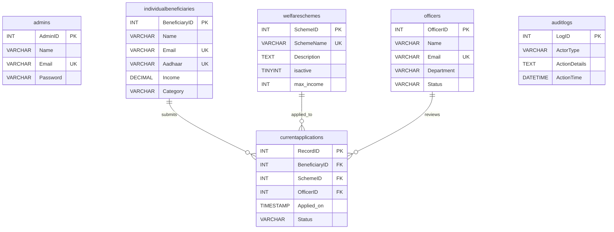

<div class="page-title">

# Government Welfare Eligibility & Tracking System
### Laboratory-10: Comprehensive Test Plan Document — Part I

<br><br>

**Prepared By:** [Your Name / Roll Number]  
**Course/Program:** [Your Course Name]  
**Date:** [Date]  
**Document Version:** 1.0  
**Reference:** 11.5.1 Planning Testing

</div>

<div style="page-break-after: always;"></div>

---

# 1. Introduction

## 1.1 Purpose

The purpose of this Test Plan is to define a structured, repeatable, and academically rigorous testing strategy for the **Government Welfare Eligibility & Tracking System**. This document prescribes the complete verification and validation methodology—encompassing **Unit Testing**, **Integration Testing**, and **System Testing**—to be executed across four critical subsystems of the application architecture.

The test plan employs both **Black-Box** (functional, specification-driven) and **White-Box** (structural, implementation-driven) testing techniques to ensure exhaustive coverage of the system's behavioral and architectural correctness. The overarching objective is to guarantee that the Tri-Portal ecosystem (Citizen Portal, Officer Portal, Administrative Dashboard) satisfies all functional requirements, enforces strict Role-Based Access Control (RBAC) policies, maintains referential integrity across the MySQL persistence layer, and upholds the deterministic state-transition logic governing application lifecycle workflows.

## 1.2 Scope of Testing

This test plan targets the following four subsystems, selected for their criticality within the system's operational taxonomy:

| # | Subsystem | Scope of Testing |
|---|-----------|------------------|
| 1 | **Authentication & Access Control** | Google OAuth 2.0 login/logout flow, session management via `express-session`, RBAC middleware enforcement across `admin`, `officer`, and `citizen` route namespaces. |
| 2 | **Citizen Enrollment & Profile Management** | Citizen auto-registration during first OAuth login, profile data retrieval via `/api/citizen/profile/:id`, demographic attribute persistence in the `individualbeneficiaries` table. |
| 3 | **Scheme Discovery & Application Processing** | Retrieval of active welfare schemes (`isactive = 1`), application submission via `/api/citizen/apply`, eligibility boundary validation against `max_income`, and application tracking via `RecordID`. |
| 4 | **Workflow Automation & Decision Management** | Officer queue retrieval of pending applications, approval/rejection state transitions on `currentapplications.Status`, and immutable audit log generation in the `auditlogs` table. |

## 1.3 Objectives

The specific testing objectives are formulated as follows:

1. **Functional Correctness:** Validate that every API endpoint and UI interaction produces deterministic, specification-compliant outputs for all valid and invalid input vectors.
2. **Security Enforcement:** Confirm that the RBAC middleware pipeline rejects unauthorized cross-role access attempts with appropriate HTTP `401 Unauthorized` responses.
3. **Data Integrity:** Verify that all `INSERT`, `UPDATE`, and `SELECT` operations against the MySQL `welfare_system` database maintain strict referential integrity via enforced `FOREIGN KEY` constraints.
4. **State Machine Compliance:** Ensure that the application status field transitions strictly within the defined state set `{Pending, Under Review, Approved, Rejected}` and that each transition is atomically logged.
5. **Regression Safety:** Establish a baseline suite of test cases that can be re-executed after future code modifications to detect unintended behavioral regressions.

## 1.4 Intended Audience

This document is intended for:

- **Course Instructor / Lab Evaluator** — For academic assessment of testing methodology and coverage.
- **Development Team Members** — For executing the prescribed test procedures and recording empirical evidence.
- **Quality Assurance Reviewers** — For evaluating the completeness and traceability of the test design.

<div style="page-break-after: always;"></div>

---

# 2. Relationship to Other Documents

This Test Plan document does not exist in isolation; it derives its requirements, architectural context, and validation criteria from a constellation of interrelated project artifacts. The following table establishes the formal traceability matrix between this document and its source references:

| Document | Relationship | Description |
|----------|-------------|-------------|
| **Project Report** (`Project_Report.md`) | **Primary Reference** | Provides the complete architectural specification of the Tri-Portal system, including the Three-Tier Network Logical Model (Presentation → Business Logic → Persistence), the MERN-variant technology stack, RBAC policy definitions, and the database schema design employing Third Normal Form (3NF) normalization. All test cases in this plan are derived from functional requirements articulated therein. |
| **Database Schema** (`DB_SCHEMA.md`) | **Data Layer Reference** | Defines the exact table structures (`admins`, `officers`, `individualbeneficiaries`, `welfareschemes`, `currentapplications`, `auditlogs`), column data types, `UNIQUE` index constraints, `FOREIGN KEY` referential integrity rules, and seed data. White-box test cases directly reference these constraints for validation. |
| **Seed Database Script** (`seed-database.sql`) | **Test Data Reference** | Contains the SQL initialization script that provisions the `welfare_system` database with baseline test data, including a default Admin (`admin@govt.in`), Officer (`aarti@govt.in`), Citizen (`john@example.com`), and sample welfare schemes. This seed data forms the prerequisite state for all test case execution. |
| **Implementation Plan** (`ImplementationPlan.md`) | **Test Strategy Reference** | Outlines the strategic testing approach, subsystem selection rationale, and screenshot placeholder methodology adopted in this plan. |
| **Backend Source Code** (`backend/server.js`, `backend/routes/*.js`) | **Implementation Reference** | The actual Express.js route handlers, Passport.js Google OAuth strategy configuration, and MySQL parameterized query logic against which White-Box test cases are structurally designed. |
| **Frontend Source Code** (`frontend/src/pages/*`) | **UI Reference** | The React.js component hierarchy and client-side routing logic (`react-router-dom`) against which Black-Box system-level test cases validate user-facing workflows. |

### 2.1 Standards and References

- **IEEE 829-2008** — Standard for Software and System Test Documentation, informing the structural organization of this plan.
- **IEEE 730-2014** — Software Quality Assurance Processes, guiding the quality criteria definitions.
- **ISTQB Foundation Level Syllabus** — Providing the theoretical framework for Black-Box (Equivalence Partitioning, Boundary Value Analysis) and White-Box (Statement Coverage, Decision Coverage) testing techniques.
- **RFC 6749** — The OAuth 2.0 Authorization Framework, referenced for authentication flow validation.

<div style="page-break-after: always;"></div>

---

# 3. System Overview

## 3.1 System Architecture

The **Government Welfare Eligibility & Tracking System** is architected as a decoupled, full-stack web application adhering to a strict **Three-Tier Logical Architecture**:

```
┌─────────────────────────────────────────────────────────────────┐
│                    TIER 1: PRESENTATION LAYER                   │
│          React.js SPA (Vite ES-Module Bundler, Port 5173)       │
│     ┌──────────┐    ┌──────────────┐    ┌────────────────┐      │
│     │  Citizen  │    │   Officer    │    │     Admin      │      │
│     │  Portal   │    │   Portal     │    │   Dashboard    │      │
│     └────┬─────┘    └──────┬───────┘    └───────┬────────┘      │
│          │                 │                    │                │
│          └─────────────────┴────────────────────┘                │
│                            │ Axios HTTP/REST                    │
├────────────────────────────┼────────────────────────────────────┤
│                    TIER 2: APPLICATION LAYER                    │
│          Node.js + Express.js API Server (Port 5000)            │
│     ┌──────────┐  ┌───────────┐  ┌──────────┐  ┌──────────┐    │
│     │  Auth    │  │  Citizen   │  │ Officer  │  │  Admin   │    │
│     │ Routes   │  │  Routes    │  │ Routes   │  │ Routes   │    │
│     └────┬─────┘  └─────┬─────┘  └────┬─────┘  └────┬─────┘    │
│          │              │              │              │          │
│     [ CORS ] → [ Session ] → [ Passport.js ] → [ RBAC ]        │
├────────────────────────────┼────────────────────────────────────┤
│                    TIER 3: PERSISTENCE LAYER                    │
│              MySQL 8.x (InnoDB Engine, welfare_system)          │
│     ┌────────────────────────────────────────────────────┐      │
│     │  admins │ officers │ individualbeneficiaries       │      │
│     │  welfareschemes │ currentapplications │ auditlogs  │      │
│     └────────────────────────────────────────────────────┘      │
└─────────────────────────────────────────────────────────────────┘
```

## 3.2 Technology Stack

| Layer | Technology | Version | Purpose |
|-------|-----------|---------|---------|
| Frontend | React.js | 18.x | Single-Page Application with declarative UI rendering via Virtual DOM |
| Bundler | Vite | 7+ | Native ES-Module development server with HMR (Hot Module Replacement) |
| Routing (Client) | React Router DOM | 6.x | Client-side SPA routing without full-page reloads |
| HTTP Client | Axios | Latest | Promise-based HTTP client with interceptor support for API communication |
| Backend Runtime | Node.js | 18+ | Asynchronous, non-blocking event-loop server environment |
| Web Framework | Express.js | 4.x | Minimalist middleware-driven HTTP request/response pipeline |
| Authentication | Passport.js + Google OAuth 2.0 | Latest | Delegated identity verification via Google's authorization servers |
| Session Management | express-session | Latest | Server-side session persistence with configurable cookie parameters |
| Database | MySQL | 8.x | ACID-compliant relational database with InnoDB storage engine |
| DB Driver | mysql2/promise | Latest | Async/await compatible MySQL driver with connection pooling |
| File Handling | Multer | Latest | Multipart form-data middleware for binary document uploads |

## 3.3 Database Entity-Relationship Summary

The `welfare_system` database comprises six interrelated tables enforcing strict referential integrity:



## 3.4 Subsystem Decomposition

The system is logically decomposed into the following subsystems, of which **four** are targeted for testing in this plan:

| Subsystem | Key Components | Responsibility | Tested? |
|-----------|---------------|----------------|---------|
| **Authentication & Access Control** | `authRoutes.js`, `server.js` (Passport Strategy), `express-session` | Handles Google OAuth login/logout, session cookie management, and RBAC enforcement across route namespaces | ✅ **Yes** |
| **Citizen Enrollment & Profile Management** | `citizenRoutes.js` (`/profile`), `server.js` (auto-registration in OAuth callback) | Manages citizen auto-registration on first login, profile data retrieval, and demographic persistence | ✅ **Yes** |
| **Scheme Discovery & Application Processing** | `citizenRoutes.js` (`/schemes`, `/apply`, `/track`), `adminRoutes.js` (`/schemes` CRUD) | Retrieves active schemes, processes application submissions, and provides tracking capabilities | ✅ **Yes** |
| **Workflow Automation & Decision Management** | `officerRoutes.js` (`/queue`, `/approve`, `/reject`), `auditlogs` table | Manages officer verification queue, approval/rejection decisions, and audit trail generation | ✅ **Yes** |
| eKYC & Identity Verification | `citizenRoutes.js` (`/documents`) | Document upload and identity verification | ❌ Out of Scope |

## 3.5 Application Status State Machine

A critical behavioral model governing the `currentapplications.Status` field:

```
                    ┌─────────────┐
   Application  ──►│   Pending   │
   Submitted        └──────┬──────┘
                           │
                    Officer Reviews
                           │
                  ┌────────┴────────┐
                  ▼                 ▼
          ┌──────────────┐  ┌──────────────┐
          │   Approved   │  │   Rejected   │
          └──────────────┘  └──────────────┘
```

Valid transitions: `Pending → Approved`, `Pending → Rejected`. All transitions are atomically logged in the `auditlogs` table.

---

<br>

> **— End of Part I —**
>
> Continue to `test_plan_2.md` for Sections 4 (Features to be Tested / Not to be Tested), 5 (Pass/Fail Criteria), and 6 (Approach).
